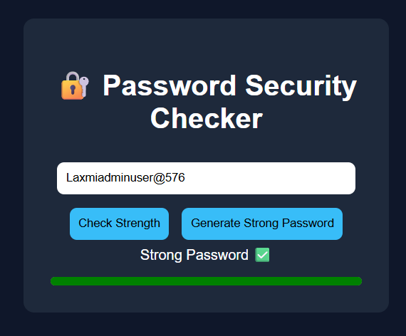

# 🔐 Password Security Tool

## 📌 Project Description
This is a simple web-based Password Strength Checker and Generator tool.  
It helps users create strong passwords and check the strength of existing passwords.

---

## ✨ Features
- Password strength checker (Weak / Medium / Strong)
- Strong password generator
- Visual strength indicator bar
- Simple and user-friendly interface

---

## 🛠️ Technologies Used
- HTML
- CSS
- JavaScript

---

## 🚀 How to Run
1. Download or clone the repository  
2. Open `index.html` in any browser  
3. Start testing passwords

---

## 👨‍💻 Project Details
**Created By:** Your Name (Laxmi / or your actual name)  
**Submitted By:** Your Name  
**Course:** Cyber Security Capstone Project  
**Institution:** (your college/school name if needed)  
**Year:** 2026  

---

## 📷 Screenshots

---

## 🔮 Future Scope
- Add password breach detection using APIs  
- Add login system with encryption  
- Improve UI with animations  
- Mobile responsive version

---

## 📌 Note
This project was developed as part of a Cyber Security Capstone assignment.

---

Submitted By: Laxmi Ananda Sanas

---
